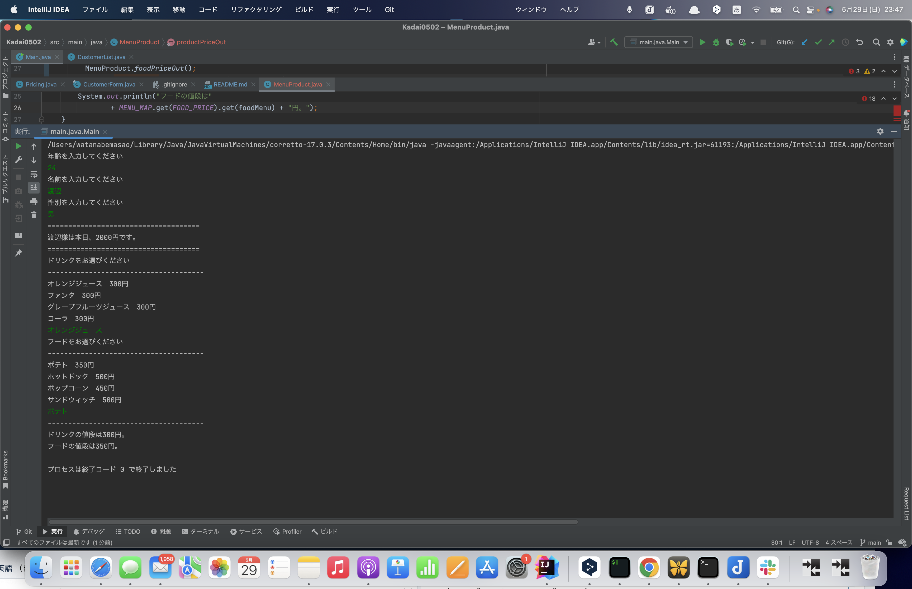

# 課題２回目
## 課題内容
- Dogクラスを参考に何かオリジナルのクラスを作ってみましょう。
- for文を使った繰り返し処理を実装してみましょう。
- if文を使った条件分岐処理を実装してみましょう。
## 今回の作成したも物の概要
顧客リストより作成したデータを条件分岐を行い価格を抽出させるもの(映画館ぽい感じの)条件分岐のイメージを説明すると、
- 子供(12才以下)は毎日半額料金にて出力。
- 女性は毎週木曜日は3割引きという条件のもと分岐を行い出力結果に反映。
## 各種ファイルの説明
### 1.CustomerForm
顧客情報に必要な変数を宣言し、コントラクタを作成。   
**age = 年齢**   
**name = 名前**   
**gender = 性別**   
各種フィールド変数に対して**getter**を配置しております。
### 2.CustomerList
顧客情報を**CustomerForm**で作成したクラスからインスタンス化を行いリストを作成。

リストで使用している **ver** はJava 10からの型推論というものらしく、つまりこのプログラムはJava10以降のversionが必要。

別にのけても動くのでその場合はJava8以降のversionで動作します。  
今回は戻り値が**ArrayList**で見て分かりやすい為適応しても大丈夫だという判断をしました。

~~提出は各分岐の出力結果が並べて見れるよう、8パターン用意しております。~~  
~~no5〜no8はエラー排出の確認用のリストとなっております。~~

### 3.~~Pricing~~ CinemaPricing

ここのクラスは処理層として設計しました。  
**DayOfWeek**を使用することで自動で曜日を取得し、出力結果に反映させるようにしております。

#### 処理の流れ
1. 年齢のエラーの値を設定
2.  性別の不正の値が入力された場合の設定
3. 年齢に分岐
4. 性別による分岐
5. 曜日イベントによる分岐    
   この流れを経由し、出力結果に反映させるようになっております。
#### 想定される不本意な出力結果
女性のイベント時の割引率が子供の割引率を上まった場合、『子供＆女性』という属性を持った人が年齢で先に処理が行われるため高い料金が適用されてしまう。
### 4.Main
今回は、**Main**をスッキリさせることを意識して行いました。  
ただやりすぎて逆に何の意味もなさそうなクラスになっちゃいました。（課題のforを無理矢理使用）  今後、管理上で店舗が増えたり違ったデータリストなど扱う時に意味をなしてくると信じます。
## 出力結果

## 今回意識した点
1. 管理のしやすさや見やすさ。
2. 変更、追加、拡張がしやすそうな感じ。
3. できる限りシンプルに作る。  
# 修正
1.~~Pricing内の曜日取得に関するコードの記述を**if**から**配列**に変更しました。~~
  ~~**LocalDate.now**にて今日の曜日を取得した後、値を**getValue**にて数値型に変換後**callDayWeek**にて配列の番地を読み取り**CallDayWeek**に送るためのクラスメソッドです。~~  
  ~~曜日は７日間固定の為これ以上インデックスの中身が変わることが無いためこちらの変更を採用しました。~~
2. Pricing内、料金選別用の条件分岐に関するネストを改善しました。
3. Pricing内の曜日取得に関するコードの記述を**DateTimeFormatter**に最変更。
4. Pricing内の記述の仕方を一部変更。
5. finalな定数名を**UPPER_SNAKECASE**に変更。
6. **CustomerForm comの**因数名を**CustomerForm Classify**に変更。
7. **CustomerForm**内コメント修正。
8. フォーマットの修正　CHeckStyleを使用。

# 第３回目
## 課題内容
- String型のListかMapを作成して、その内容をコンソール画面に表示してみよう。 
- Listに入れる内容は何でもOKだが、複数入れること。任意のプログラムで例外を起こしてみる。 
- 課題のソースコードをGitHubにpushしてレビューを依頼する。  
## 今回の追加修正ポイント

### クラス MenuProductの追加  
**<String, String>** 型の **HashMap** に **<String, Integer>** 型の **HashMap** を入れ子にしております。  
1. **<String, String>** **<k = カテゴリー, v = 品名>**  
2. **<String, String>** **<k = 品名, v = 価格>**
という状態になっております。  
今回これを行った目的はコンソールからの入力処理の際、カテゴリー別の品名一覧を**forEach**で出力しやすくする。 
本来、重複keyが使用できない一つの**HashMap**の中でカテゴリーで分けた処理を行うという点であります。  
### コンソール入力の実装
コンソール入力を行い、**年齢、名前、性別、ドリンクメニュー、フードメニュー**を入力し、  
その値を下に各種クラスよりデータを受け取り出力を行う様に変更しました。  
それに伴い、クラス**CustomerList**の内容を修正。
コンソール用の**setter**を配置。  
### 細かい修正
**foodPrice**等の価格にまつわる要素が増えた為**price**など既存のメソッド名を等を見直し。
## 出力結果
  
## 今回やろうとしたができなかったこと  
- フードメニューとドリンクメニューの合計値を出力し、最終全ての合計金額を出力する。  
型の問題でうまく処理が行えな買ったり、計算はできてもその値をコンソール入力した結果として持ってくることができなかった。  
クラス内の設計の難しさ、要素が増ると、その要素の組み立てなどどのように扱うかの難しさを学びました。
更に既存クラス**CinemaPricing**の役割が多く、ここでの処理結果を使用したいと思った際、なかなか思うようにいかなかった。
- フードメニューとドリンクメニューをセットで買った場合のバンドルマッチ割引。
今までの条件分岐は片方が定数であった為、買った場合、買わなかった場合、両方買った場合などのコンソールの入力に左右される要素をどうコードに表現するかが難しかった。  
クラスを分けるやり方、配列を使うやり方等色々検証したが思う様にいかず断念。  
現状の案としてはコンストラクタを各種用意し、入力された値を元にそこから生み出されたインスタンスを読み取りそのインスタンスでの識別。  
実際うまくいくかは分からないが後日行う。  
- 家族割のような処理。当然上記の様な部分で苦戦した為できなかった。
- コンソール入力に纏わる例外対応。結構想定されるものが多い為手がつけれなかった。今後の課題。  

