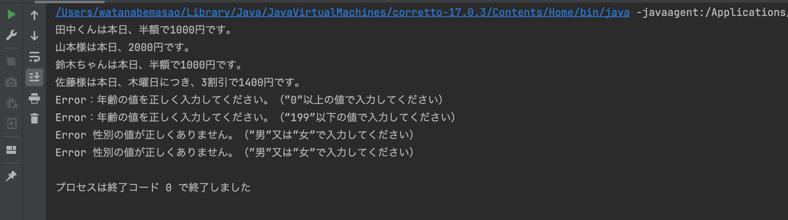

# 課題２回目
## 課題内容
- Dogクラスを参考に何かオリジナルのクラスを作ってみましょう。
- for文を使った繰り返し処理を実装してみましょう。
- if文を使った条件分岐処理を実装してみましょう。
## 今回の作成したも物の概要
顧客リストより作成したデータを条件分岐を行い価格を抽出させるもの(映画館ぽい感じの)条件分岐のイメージを説明すると、
- 子供(12才以下)は毎日半額料金にて出力。
- 女性は毎週木曜日は3割引きという条件のもと分岐を行い出力結果に反映。
## 各種ファイルの説明
### 1.CustomerForm
顧客情報に必要な変数を宣言し、コントラクタを作成。   
**age = 年齢**   
**name = 名前**   
**gender = 性別**   
各種フィールド変数に対して**getter**を配置しております。
### 2.CustomerList
顧客情報を**CustomerForm**で作成したクラスからインスタンス化を行いリストを作成。

リストで使用している **ver** はJava 10からの型推論というものらしく、つまりこのプログラムはJava10以降のversionが必要。

別にのけても動くのでその場合はJava8以降のversionで動作します。  
今回は戻り値が**ArrayList**で見て分かりやすい為適応しても大丈夫だという判断をしました。

提出は各分岐の出力結果が並べて見れるよう、8パターン用意しております。  
no5〜no8はエラー排出の確認用のリストとなっております。

### 3.Pricing

ここのクラスは処理層として設計しました。  
**DayOfWeek**を使用することで自動で曜日を取得し、出力結果に反映させるようにしております。

#### 処理の流れ
1. 年齢のエラーの値を設定
2.  性別の不正の値が入力された場合の設定
3. 年齢に分岐
4. 性別による分岐
5. 曜日イベントによる分岐    
   この流れを経由し、出力結果に反映させるようになっております。
#### 想定される不本意な出力結果
女性のイベント時の割引率が子供の割引率を上まった場合、『子供＆女性』という属性を持った人が年齢で先に処理が行われるため高い料金が適用されてしまう。
### 4.Main
今回は、**Main**をスッキリさせることを意識して行いました。  
ただやりすぎて逆に何の意味もなさそうなクラスになっちゃいました。（課題のforを無理矢理使用）  今後、管理上で店舗が増えたり違ったデータリストなど扱う時に意味をなしてくると信じます。
## 出力結果

## 今回意識した点
1. 管理のしやすさや見やすさ。
2. 変更、追加、拡張がしやすそうな感じ。
3. できる限りシンプルに作る。
